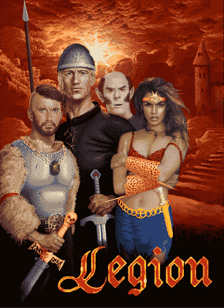

# Legion .NET

A C#/MonoGame rewrite of **Legion**, a classic Polish Amiga fantasy RPG, based
on the original AMOS Basic source code provided by its authors.

- Runs on .NET 6 + MonoGame, Windows-focused for now but built with other platforms in mind
- Polish and English text, more languages could be added later
- Original AMOS source and game assets live in [`/original`](original)

## Status

**Playable / beta** — the core game (towns, battles, world map, dialogue, shops,
save/load) is playable, but with smaller bugs and missing pieces.

### Known issues
- Missing scenery specific music.
- Lack of transparency for equipment items.
- Defaeated animation.
- Lack of full english translations.

### Improvements
- Pathfinding now uses better algorithm.

### Inherited from the original game
- Items placed on the ground can get duplicated after saving/loading
- Character pathfinding has been improved, but be aware that enemy or own units can still walk into a hole, that was not changed.

## Running the game

Requires the [.NET 6 SDK](https://dotnet.microsoft.com/download/dotnet/6.0).

```
cd src/AmigaNet.Legion/AmigaNet.Legion.DesktopApp
dotnet run
```

This builds and launches `AmigaNet.Legion.DesktopApp`, which finds the game
assets (`/original/legion`) and localized text (`AmigaNet.Legion/data/en` or
`/pl`) automatically based on its own build output location — no extra setup
needed. It defaults to English; to run in Polish, or point at a different
assets folder, pass both a language code and an (absolute) assets path:

```
dotnet run -- pl C:\repo\amiga-dotnet-legion\original\legion
```

## Links
* Original source code: https://www.ppa.pl/rodzynki/legion.html
* Interview with author 1 [PL]: https://www.ppa.pl/gry/rozmowa-z-marcinem-puchta-wspolautorem-gry-legion.html
* Interview with author 2 [PL]: https://www.ppa.pl/gry/rozmowa-z-andrzejem-puchta-autorem-gry-legion.html
